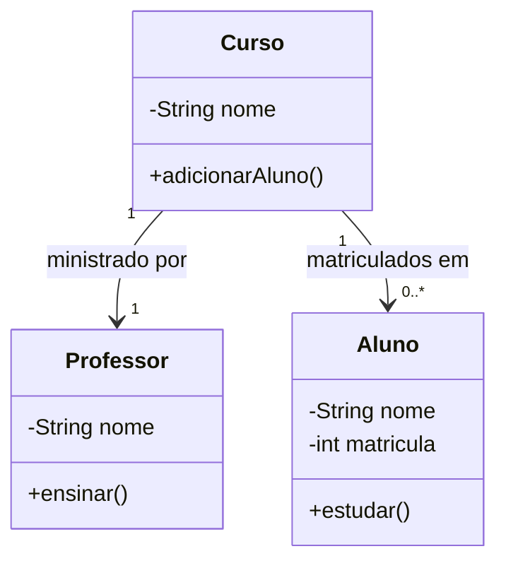

# Associações em POO - Guia Rápido com UML e Java

##  O que são Associações?

Relacionamentos entre classes em Programação Orientada a Objetos.

### 1. Associação Simples

Principal característica: Relacionamento básico onde as classes existem independentemente.

